 > **English text is below**

# Street View

## このプラグインについて

-  Googleストリートビューで取得した画像を表示します。あらかじめ指定したルートに沿ってストリートビューの画像を順次表示することができます。また、マーカーをクリックすると、インフォボックスにストリートビューで取得した画像を表示することもできます。
　
## 使用方法

### 右パネルの設定項目

- APIキー

  GoogleストリートビューAPIを利用するためのキーを設定します。
  
  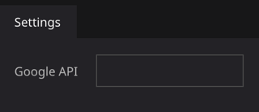

- APIキーの作成

     [googleのドキュメント](https://developers.google.com/maps/documentation/javascript/get-api-key?hl=ja)等を参考にAPIキーを作成します。

     - プロジェクトの作成

          Google Cloudプロジェクトが未作成の場合は[リンク先](https://developers.google.com/maps/documentation/javascript/cloud-setup?hl=ja)等を参考にプロジェクトを作成してください。まず課金設定を行ない、その後プロジェクトを作成する手順となります。課金設定は必要ですが、無料枠が設けられていますので、それを超えるまでは実際には課金されません。

     - APIの有効化

          プロジェクト作成後、[リンク先](https://developers.google.com/maps/documentation/javascript/cloud-setup?hl=ja#enabling-apis)の手順に従って、Maps JavaScript APIを有効にしてください。
          具体的には作成したプロジェクトを選択し、「+APIとサービスの有効化」を押します。
 
           

          次の画面で、「Maps JavaScript API」を押します。
 
          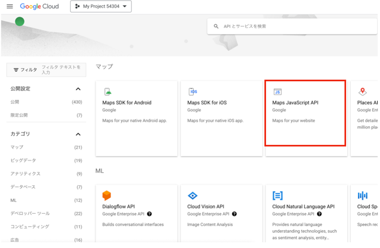 

          「有効にする」ボタンを押します。
 
          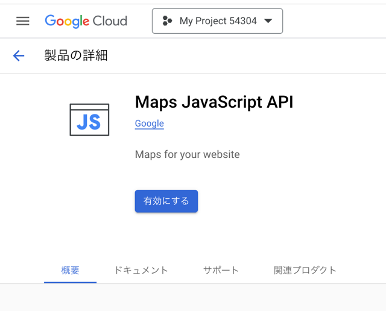 

 
          APIが有効になり、APIキーが表示されます。この値を「APIキー」に設定します。

          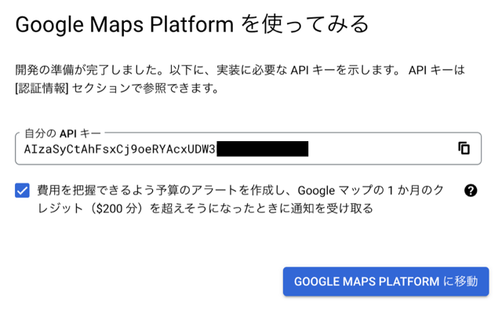 

          APIメニューで「Maps JavaScript API」が有効になっていることを確認しておいてください。

          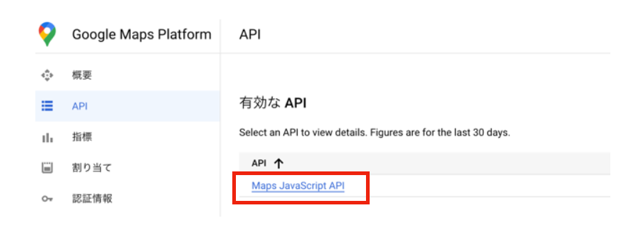 

          必要に応じてAPIキーの利用制限を掛けることができます。ブラウザからの直接アクセスになりますので、 IPアドレスによる制限が可能です。「ADD」ボタンで、利用する機器のIPアドレスを登録していきます。

          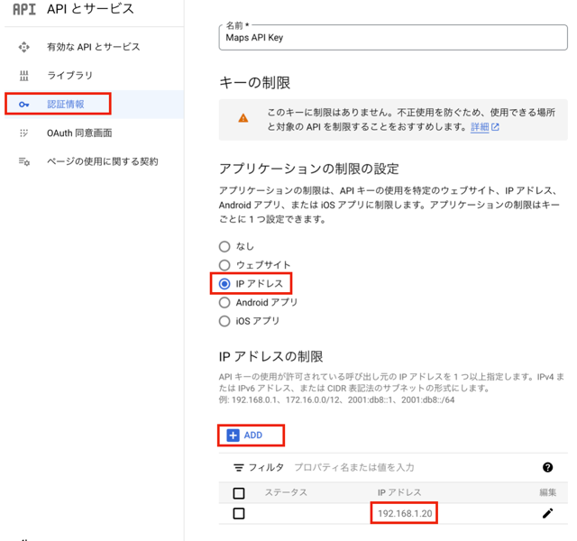 

    
### 操作方法
- ルートの作成と再生

     ストリートビューを表示するルートを作成します。マニュアル操作で作成する方法と、あらかじめ作成したルートを読み込む方法の２通りがあります。

     - マニュアルでルートを作成する

          ルート作成方法に「Drawing」選択するとマニュアルルート作成モードになります。「図形を描く」ボタンを押すしルート作成を開始します。この状態で、表示したいルートに沿って、マウスの左ボタンをクリックするとルートが作成されます。「完成する」ボタンを押すと描画モードを終了します。Startボタンを押すと、作成したルートに沿ってストリートビューを表示していきます。

          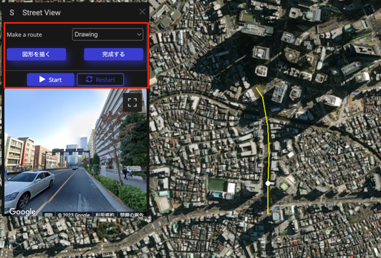 

     - ファイルを読み込む方法
        
          ルート作成方法に「Upload a file」を選んで、事前に作成したルートファイルを選択します。ファイルを読み込んだ後「Start」ボタンを押すと読み込んだルートの開始位置にカメラが移動し、ルートに沿ってストリートビューを表示していきます。ルートファイルの作成はルート検索プラグインがご利用いただけます。

          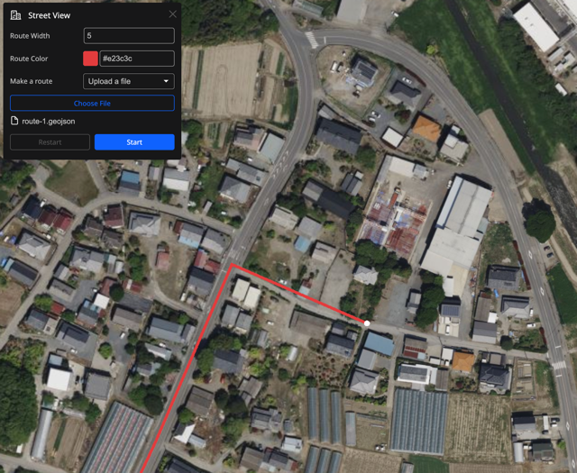
     - ルート ファイル リスト（設定エリア）からルート ファイルを選択する
             
          設定エリア[ルートファイルリスト]から[+]アイコンを押してルートファイルをアップロードします。 ルート ファイル番号を選択すると、ファイルとタイトルの入力が表示されます。 geojson ファイルをリソース (アップロード済み) またはコンピューターからアップロード する。[select a route]というオプションを選択すると、プラグイン UI にルート ファイルのリストが表示されます。 ルートファイルを選択し、[start]ボタンを押 する。
          

          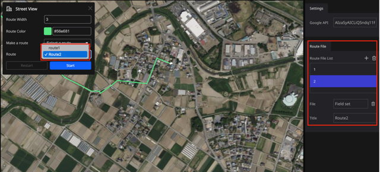
    
- インフォボックス内表示

     - Markerを配置し、インフォボックスでStreetViewプラグインをインストールします。

     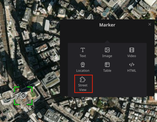

     - StreetViewプラグインをインストールすると、右パネルのメニューに設定項目が表示されます。Google APIにはAPIキーを設定します。

     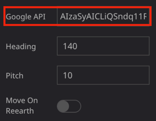

     - Markerをクリックして選択するとカメラがマーカに移動しますが、その時のカメラの方向と傾きをHeading/Pitchで指定します。

     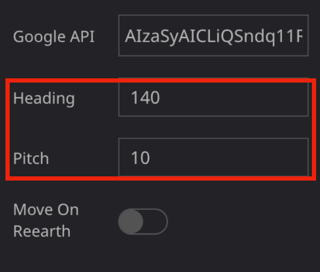

     - Move On ReearthスイッチをOnにすると、StreetViewのカメラと連動してRe:Earthのカメラも動く様になります。

     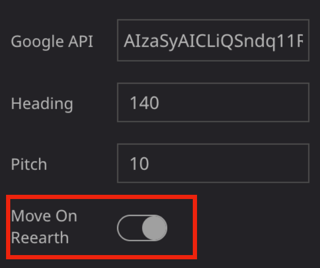

## 重要事項
- 本プラグインを使用したことにより生じたいかなる損害についても、弊社は一切の責任を負いません。
- データ保護はお客様の責任です。 情報を保護するために適切な措置を講じてください。
- APIキーが他人に知られると不正利用される恐れがあります。APIキーが漏れないようにご注意ください。
- 無料トライアルが終了するか、無料クレジットがゼロになると、Googleクラウドの使用には費用がかかります。使用量を確認し、アカウントを保護するための措置を講じてください。
- 利用料金に関しましては、お支払いページでAPI利用状況をご確認の上、ご自身で管理してください。

     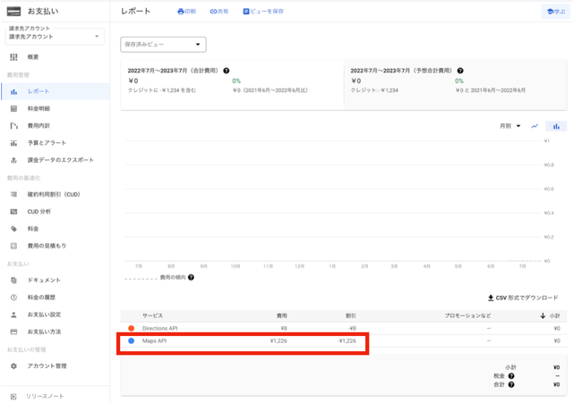

## 備考
- テストブラウザ環境
  - OS:Mac OS Montery 12.6.5
  - ブラウザ：Google Chrome 112.0.5615.121

## 開発者欄

このプラグインは、Re:Earth公式プラグインです。

 

ソースコードはこちら(https://github.com/eukarya-inc/reearth-plugin-street-view)

- コミュニティ

  - このプラグインを利用したプロジェクトをユーザーコミュニティでシェアしましょう。

  - このプラグインについての不明点がある場合にもここからRe:Earthチームや他の開発者に質問することができます。

  - Discordへのリンクはこちら(https://discord.gg/BXcQhvwqqM)

---

# Street View

## About this plugin

-  Displays images acquired from Google Street View. Street View images can be displayed sequentially along a pre-designated route. You can also click a marker to display images acquired by Street View in the infobox
　
## How to use

### Right panel menu settings

- API key

  Set a key to use Google Street View API.
  
  

- Creating API Key

     You can find document [here](https://developers.google.com/maps/documentation/javascript/get-api-key).

     - Creating a project

          If you have not yet created a Google Cloud project, please refer to the [link](https://developers.google.com/maps/documentation/javascript/cloud-setup)
           below to create a project. First, set up the billing settings, and then create the project. You need to set up billing, but there is a free quota, so you will not be charged until you exceed it.

     - Enable API

          After creating a project, follow the instructions in the [link](https://developers.google.com/maps/documentation/javascript/cloud-setup#enabling-apis) to enable the Maps JavaScript API. Specifically, select the project you created and press “+Activate API and Services”.
 
           

          On the next screen, click “Maps JavaScript API”.
 
           

          Click the “Enable” button.
 
           

          The API will be enabled and the API key will be displayed. Set this value to “API Key”.

           

          Please make sure that “Maps JavaScript API” is enabled in the API menu.

           

          API key usage can be restricted as needed. Since the API key is accessed directly from the browser, it can be restricted by IP address. Click the “ADD” button to register the IP address of the device to be used.

           

    
### How to operate
- Route Creation and Playback

     Create a route to display Street View. There are two ways to create a route: manually or by loading a pre-created route.

     - Manual route creation

          Select “Drawing” as the route creation method to enter manual route creation mode. Click the “Drawing” button to start route creation. In this state, click the left mouse button along the route you wish to display to create the route. Click the “Finish” button to exit the drawing mode, or click the “Start” button to display the Street View along the route you have created.

           

     - Use pre-created route file method
        
          Select “Upload a file” as the route creation method and select the route file you have previously created. After loading the file, click the “Start” button to move the camera to the starting position of the loaded route and display Street View along the route. The route search plug-in is available for creating route files.

          

     - Select a root file from the root file list
             
          Upload the root file by pressing the [+] icon from the configuration area [Root File List]. After selecting the root file number, you will be prompted to enter the file and title. Upload the geojson file from a resource (already uploaded) or from your computer. Select the option “select a route” and the plug-in UI will display a list of route files. Select a route file and press the “start” button.
          

          
    
- Display in infobox

     - Place a marker and install the StreetView plugin in the infobox.

     

     - fter installing the StreetView plugin, the configuration items appear in the right panel menu.

     

     - Clicking and selecting Marker moves the camera to the marker, and Heading/Pitch specifies the direction and tilt of the camera at that time.

     

     - When the 'Move On Reearth' switch is set to On, the Re:Earth camera will also move in conjunction with the StreetView camera.

     

## IMPORTANT NOTIFICATION
- WE TAKE NO RESPONSIBILITY FOR ANY DAMAGE CAUSED BY THE USE OF THIS PLUGIN.
- DATA PROTECTION IS YOUR RESPONSIBILITY. MAKE SURE YOU TAKE APPROPRIATE STEPS TO PROTECT YOUR INFORMATION.
- IF THE API KEY IS KNOWN TO OTHERS, IT MAY BE MISUSED.
- USING GOOGLE CLOUD WILL COST YOU WHEN YOUR FREE TRIAL EXPIRES OR YOUR FREE CREDIT REACHES ZERO. MAKE SURE YOU KNOW HOW MUCH YOU ARE USING AND TAKE STEPS TO PROTECT YOUR ACCOUNT.
- WE STRONGLY RECOMMEND THAT YOU CHECK THE API USAGE STATUS ON THE PAYMENT PAGE AND MANAGE THE USAGE FEES BY YOURSELF.

     

## Additional Information
- Test condition
  - OS:Mac OS Montery 12.6.5
  - Browser：Google Chrome 112.0.5615.121

## For Developer
- This is an official Re:Earth plugin.

  

The source code is here (https://github.com/reearth-plugins/reearth-plugin-street-view)

- Community

  Re:Earth user community is always welcome to your contribution to share your project developed with this plugin.
  If you have any questions about this plugin, you can ask the Re:Earth development team and other developers on [Discord](https://discord.gg/BXcQhvwqqM).)
